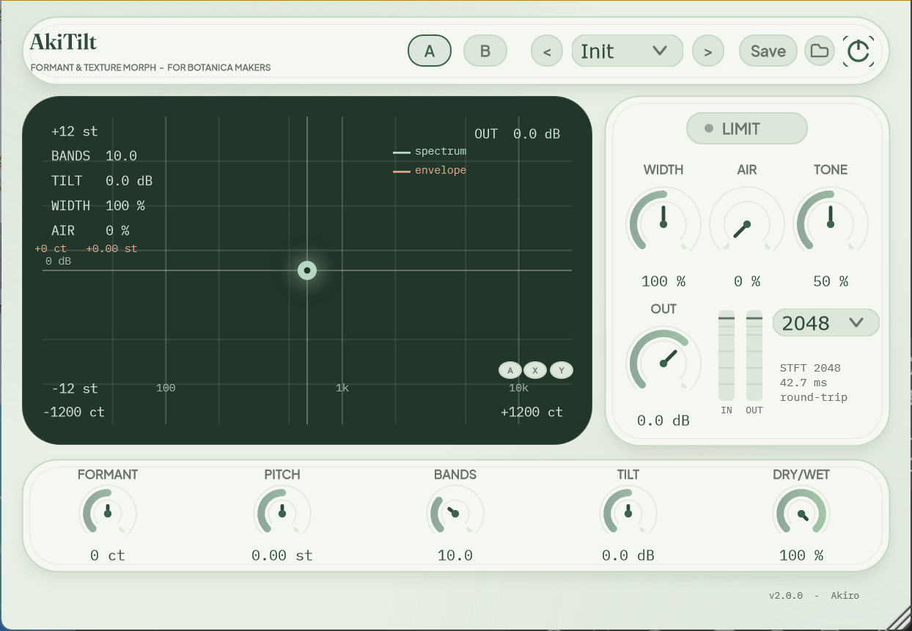

<div align="center">

# AkiTilt

**User Manual　·　使用说明书**

Version 2.0.0

---

## 1　Welcome

AkiTilt is a formant and texture morph plugin for Botanica (petalcore)
production. It shifts the spectral envelope of any sound — voice, guitar,
synth, a whole mix — without changing its pitch, and surrounds that core with
the companions such workflows ask for: pitch shift, brightness tilt, stereo
width and an air bed.

Pair a breathy vocal recording with Fairy Choir, or automate formant across a
guitar loop — AkiTilt is built for exactly those moves.

> This manual covers installation, every control, the presets, and answers to
> common questions. Enjoy the garden.

## 2　At a Glance



| Area | Contents |
|---|---|
| Header | Preset selector, previous / next, A/B compare, power (bypass) |
| Center | XY pad — formant × pitch, with live spectrum display |
| Right | FFT size selector, Limiter, Width / Air / Tone, Out, level meters |
| Bottom | Formant, Pitch, Bands, Tilt, Dry/Wet |

## 3　Installation

**VST3 (in your DAW)**

1. Copy `AkiTilt.vst3` to `C:\Program Files\Common Files\VST3` (Windows) or
   `/Library/Audio/Plug-Ins/VST3` (macOS).
2. Restart your DAW and insert AkiTilt on an audio track.

**AU (macOS)**

Copy `AkiTilt.component` to `/Library/Audio/Plug-Ins/Components` and restart
your DAW.

**Standalone**

Run `AkiTilt.exe` (Windows) or `AkiTilt.app` (macOS). Choose your audio
device under *Options → Audio settings*.

> The standalone mutes its audio input by default to prevent feedback. Use
> headphones if you enable live input.

## 4　Quick Start

1. Insert AkiTilt on a vocal or instrument track.
2. Drag the dot on the **XY pad**: right = brighter / smaller formants,
   left = darker / larger; dragging up or down shifts the pitch.
3. Try a preset — *Fairy Choir* for an ethereal choir, *Gender Morph* for a
   convincing voice swap.
4. Blend with **Dry/Wet**, then set **Tilt** to sit in the mix.

## 5　The Signal Chain

```
input ─► Formant ─► Pitch ─► Tilt ─► Width ─► Air ─► Dry/Wet ─► Out ─► Limiter
   └── (delay-aligned dry path) ────────────────────────────────┘
```

The formant stage runs at a selectable STFT resolution — 128 to 4096 points,
2048 by default (see *FFT Size* below).

## 6　Controls Reference

### Formant　±1200 ct

Moves the spectral envelope — the resonance fingerprint of a sound — while
leaving pitch untouched. Positive values make a source sound smaller,
brighter, more feminine or childlike; negative values sound larger, darker,
more masculine. Small amounts (±100…300 ct) are enough for character;
extremes are for sound design.

### Auto Formant　A / off

The **A** pill at the bottom-right of the XY pad switches the formant engine
to pitch tracking. A detector follows the fundamental of the input (60 Hz–1
kHz), and the formant shift follows it: higher notes get smaller, brighter
formants — the way a smaller vocal tract sounds. The anchor is A3 (220 Hz):
an input at 220 Hz applies no extra shift, an octave above applies +1200 ct.
The **Formant knob stays active as a fine offset** (±1200 ct) added on top of
the tracked value. While Auto is engaged the pad's cursor shows the live
detected value, X-axis dragging is disabled and the **X** lock dims; turning
Auto off restores manual control instantly. When the input is silent or
non-tonal the tracked shift glides back to the knob value over about 1.5 s.

### Pitch　±12 st

Conventional pitch shift, decoupled from formant. Formant +320 ct with
Pitch −2 st is the classic "voice swap": the character changes while the
melody stays in key.

### Bands　0–32

Controls how finely the formant engine reads the spectrum. Low values track
spectral detail closely (harder, more artificial morphs); high values produce
smooth, natural envelope curves. The default 10 suits most material.

### FFT Size　128–4096

The analysis window of the formant stage, chosen from the selector in the
right card (the status text below it shows the current size and its
round-trip time). It is a trade-off:

| Size | Latency | Character |
|---|---|---|
| 128 | ≈ 2.7 ms @ 48 kHz | Snappiest, tracks fast moves, grainy on sustained tones |
| 512 | ≈ 10.7 ms | Good balance for rhythmic material |
| 2048 (default) | ≈ 42.7 ms | The reference sound — smooth, stable formants |
| 4096 | ≈ 85.3 ms | Smoothest, most "locked-in" morphs, highest latency |

The **Bands** knob is defined in bins, exactly like the analysis itself: it
keeps its full sweep at every FFT size. A given Bands value covers
proportionally more Hz at smaller sizes — the bands are physically wider
there, which is part of the coarser small-size character. Changing the size
restarts the analysis: the wet path briefly falls silent, so switch
while playback is stopped. This control is a setup choice, not automatable.

### Tilt　±12 dB

One knob, two shelves mirrored around 650 Hz: positive brightens, negative
darkens, with automatic loudness compensation. At 0 dB the stage is bypassed
bit-exactly.

### Width　0–200 %

Mid/side widening applied to the effect path. Below 100 % narrows toward
mono, above 100 % spreads the processed image. 100 % is exact unity.

### Air　0–100 %　·　Tone　0–100 %

A filtered noise bed mixed into the effect — the room a sound lives in.
Tone sweeps the bed's colour from warm rumble (low) to open air (high), 800
Hz–12 kHz at constant loudness. The bed **tracks your input level
continuously** — the louder the sound, the louder the air, like a layer of
noise wrapped around it; in silence it fades out within half a second. The
analysis panel mirrors Tone in its background: green at the default, brown
toward the low end, grass-green toward the high end.

### Dry/Wet　0–100 %

Crossfade between the untouched signal and the effect. 100 % by default.

### Out　−24…+12 dB

Output level. Raising it pushes the built-in soft limiter harder for a
gentle, warm ceiling.

### Limiter / Power

**LIMIT** toggles the output limiter (off by default). The round power
button bypasses the plugin (the dry path stays delay-aligned, so toggling is
click-free).

## 7　The XY Pad

The pad maps **Formant** horizontally and **Pitch** vertically, so a voice
character can be swept in one gesture — and automated as two parameters in
your DAW. The **A**, **X** and **Y** buttons at the bottom-right of the pad
control the axes: **A** engages Auto Formant (the detector drives the X
axis), while **X** and **Y** lock one axis so the other can be swept alone
(hold **Alt** to invert the locks for a single drag). A locked axis also
**locks its knob below** — Formant for X, Pitch for Y — marked with a small
padlock badge; the knob stays visible but cannot be changed until you release
the lock on the pad. While Auto Formant is on, the X lock and the Formant
padlock are dimmed (the detector owns the axis) and the knob keeps working as
the fine offset. Modifier keys change each drag:

| Modifier | Behaviour |
|---|---|
| (none) | Free movement on both unlocked axes |
| **Shift** | Fine adjustment, one eighth sensitivity |
| **Ctrl** | Snap — formant to 100 ct, pitch to 1 semitone |
| **Alt** | Temporarily invert the axis locks |

Double-click to reset to centre. Two curves live behind the dot:
the cool **spectrum** of what you are hearing and the warm **envelope** — the
exact curve the Bands knob reshapes. The faint full-width line is the Tilt
response; the tall ticks along the bottom edge mark the Bands regions; and
the panel background shifts with the Tone setting — green at the default,
brown toward the low end, grass-green toward the high end. The overlay in
the corners lists BANDS / TILT / WIDTH / AIR / OUT.

## 8　Presets

The preset list has two sections: nine **factory presets** (ordered from
subtle to extreme) and your own **user presets** below the separator.

- Factory presets shape the effect chain **and pick a character-matched FFT
  size** (smooth timbres get large windows, snappy ones small) — **Pitch,
  Out, Limiter and Auto Formant always stay exactly as you set them**.
- **Save** stores the complete current state (all parameters) as a user
  preset; type a name and confirm. Saving again with the same name
  overwrites it.
- The folder button opens the user preset folder (`%APPDATA%\AkiTilt\Presets`
  on Windows, `~/Library/Application Support/AkiTilt/Presets` on macOS) in
  your file manager, where you can rename, delete or copy preset files
  directly. Files are plain XML named after the preset.

| Preset | FFT | Character |
|---|---|---|
| Init | 2048 | Neutral starting point |
| Guitar Bloom | 1024 | Gentle formant lift made for automation on guitars |
| Tape Bloom | 4096 | Darkened, saturated bloom with a warm noise bed |
| Gender Morph M>F | 2048 | Male voice, feminine character |
| Gender Morph F>M | 2048 | Female voice, masculine character |
| Fairy Choir | 4096 | Ethereal, wide choir from any vocal |
| Petalcore Lead | 512 | Bright, chirpy lead for pop sections |
| Chipmunk Garden | 256 | Extreme small, cartoon-bright morph |
| Deep Oracle | 4096 | Dark, commanding character |

A/B stores two complete settings; toggle between them to judge changes
honestly.

## 9　Troubleshooting

**No sound in the standalone.** The app mutes live input to avoid feedback.
Open *Options → Audio settings*, pick an input, and use headphones.

**Null testing.** With default settings AkiTilt is transparent: unity gain,
the limiter off, and a constant delay (2048 samples at the default FFT size)
that your DAW compensates automatically. The offline latency-aligned null
measures a worst-sample residual of 0.035 % (≈ −69 dB) at 2048 points — the
window-ripple floor of the STFT algorithm, inaudible; a DAW null will also
depend on your host's PDC alignment. The **Out** knob remains for level trim
and limiter drive.

**Latency?** The formant stage delays audio by the current FFT size (2048
samples ≈ 43 ms at 48 kHz by default; 128 points ≈ 2.7 ms). The plugin
reports this to your DAW, which compensates other tracks automatically. For
live monitoring through the standalone, use headphones and expect this delay.

**Bands seems to do nothing.** Bands sets the resolution of the formant
shift, so it only shapes the sound while **Formant is away from 0** — at
0 ct the shift ratio is 1 and every Bands value is mathematically silent by
design. Set Formant to ±400 ct, then sweep Bands 3 → 20 and watch the warm
envelope curve on the panel change with it.

**Automation.** Every control except the FFT size is host-automatable. The
XY pad writes the Formant and Pitch parameters, so pad moves can also be
drawn as automation curves.

**A brief silence when changing the FFT size.** Switching the analysis
window restarts the formant engine: the wet path is silent for a moment and
the reported latency changes. Switch while playback is stopped, or let the
Dry/Wet dip mask it.

**Blurry UI in Ableton Live (crisp everywhere else).** Live's per-plugin
**"Auto-Scale Plug-in Window"** option bitmap-stretches the GUI instead of
letting it render at native resolution. Right-click the plugin in Live's
browser and disable auto-scale, then reopen the plugin window — AkiTilt will
render natively at your display's DPI and become crisp. (FL Studio and most
other hosts render natively, which is why the difference shows up only in
Live; this applies to every plugin, not just AkiTilt.)

**Auto Formant drifts back in quiet passages.** By design: without a
detectable pitch the tracked shift glides to the knob value over ~1.5 s, so
the sound settles instead of freezing on a stale note. Sing/play sustained
tones for a firm lock.

## 10　Specifications

| | |
|---|---|
| Formats | VST3, AU, Standalone (Windows x64 & macOS universal) |
| Channels | Mono or stereo in/out |
| Latency | FFT-size dependent, 128…4096 samples (default 2048), reported to host |
| Parameters | 14 (13 automatable; FFT Size is a setup setting) |
| Presets | 9 factory presets, A/B compare |
| Test coverage | Offline DSP test suite (`AkiTiltTests`) |
| License | GNU GPL v3 |

---

<div align="center">

# AkiTilt

**使用说明书**

版本 2.0.0

---

## 1　欢迎

AkiTilt 是为 Botanica（petalcore）制作打造的变形与质感插件。它可以在**不改变音高**的前提下移动任何声音的频谱包络——人声、吉他、合成器甚至整轨混音——并围绕这个核心配备了这类工作流需要的伙伴模块：音高移动、明暗倾斜、立体声加宽与空气床。

给人声呼吸声套上 Fairy Choir，或在吉他循环上自动化 formant——AkiTilt 正是为这些动作而生。

> 本说明书包含安装说明、每个控件的用法、预设一览与常见问题。祝你在这片乐园里玩得开心。

## 2　界面一览


| 区域 | 内容 |
|---|---|
| 顶栏 | 预设选择、上/下一个、A/B 对比、电源（旁路） |
| 中央 | XY Pad——formant × pitch，带实时频谱显示 |
| 右侧 | FFT 尺寸选择、Limiter、Width / Air / Tone、Out、电平表 |
| 底部 | Formant、Pitch、Bands、Tilt、Dry/Wet |

## 3　安装

**VST3（在 DAW 中使用）**

1. 将 `AkiTilt.vst3` 复制到系统 VST3 目录：Windows 为 `C:\Program Files\Common Files\VST3`,macOS 为 `/Library/Audio/Plug-Ins/VST3`。
2. 重启 DAW，在音频轨道上加载 AkiTilt。

**AU（macOS）**

将 `AkiTilt.component` 复制到 `/Library/Audio/Plug-Ins/Components`，重启 DAW。

**独立版**

运行 `AkiTilt.exe`（Windows）或 `AkiTilt.app`（macOS），在 *Options → Audio settings* 中选择音频设备。

> 独立版默认静音音频输入以防止啸叫。如需开启实时输入，请佩戴耳机。

## 4　快速上手

1. 在人声或乐器轨道上加载 AkiTilt。
2. 拖动 **XY Pad** 上的圆点：向右 = 更亮更小的共振峰，向左 = 更暗更大；上下拖动则移动音高。
3. 试试预设——*Fairy Choir* 空灵合唱，*Gender Morph* 一键换声。
4. 用 **Dry/Wet** 调混合比例，再用 **Tilt** 让它坐进混音。

## 5　信号链

```
输入 ─► Formant ─► Pitch ─► Tilt ─► Width ─► Air ─► Dry/Wet ─► Out ─► Limiter
   └────────────（延迟对齐的干路）──────────────────────────────┘
```

formant 级以可选的 STFT 分辨率运行——128 到 4096 点,默认 2048（见下方 *FFT Size*）。

## 6　控件参考

### Formant　±1200 ct

移动声音的频谱包络（共振峰结构），音高保持不变。正值让声音更小、更亮、更偏女声或童声；负值更大、更暗、更偏男声。±100…300 ct 的小幅度足以改变角色；极值留给声音设计。

### Auto Formant　A / 关

XY Pad 右下角的 **A** 药丸把 formant 引擎切到音高跟踪模式。检测器跟随输入的基频（60 Hz–1 kHz）,formant 偏移随之移动：音越高，共振峰越小越亮——正如更短的声道。锚点是 A3（220 Hz）：输入 220 Hz 不产生额外偏移，高一个八度即 +1200 ct。**Formant 旋钮保持可用,作为叠加在跟踪值之上的微调偏移**（±1200 ct）。Auto 开启时,面板光标实时显示检测值,X 轴拖动被禁用、**X** 锁变灰;关闭 Auto 立即恢复手动控制。输入静音或无音高时,跟踪的偏移会在约 1.5 秒内滑回旋钮值。

### Pitch　±12 st

常规音高移动，与 formant 完全解耦。"Formant +320 ct + Pitch −2 st"是经典的换声配方：角色变了，旋律仍在调上。

### Bands　0–32

控制 formant 引擎读取频谱的精细程度。低值紧贴频谱细节（变形更"硬"、更人工）；高值包络更平滑自然。默认 10 适合大多数素材。

### FFT Size　128–4096

formant 级的分析窗口,在右侧卡片顶部的下拉框选择（下方状态文字显示当前尺寸与往返时间）。这是一个取舍：

| 尺寸 | 延迟 | 音色特征 |
|---|---|---|
| 128 | ≈ 2.7 ms @ 48 kHz | 反应最快,跟上快速变化,持续音上偏颗粒感 |
| 512 | ≈ 10.7 ms | 节奏性素材的均衡之选 |
| 2048（默认） | ≈ 42.7 ms | 参考音色——平滑、稳定的 formant |
| 4096 | ≈ 85.3 ms | 最平滑、"锁定感"最强的变形,延迟最高 |

**Bands** 旋钮以 bin 数定义，与分析本身同源：任何 FFT 尺寸下都保持全量程。同一个 Bands 值在更小的尺寸下覆盖成比例更宽的 Hz 范围——频带在那里天然更宽，这也是小尺寸更粗糙音色的一部分。切换尺寸会重启分析：湿路会短暂无声，建议在停止播放时切换。该控件是设定项，不可自动化。

### Tilt　±12 dB

单旋钮、围绕 650 Hz 镜像的两只搁架：正值提亮、负值压暗，带自动响度补偿。0 dB 时该级位精确旁路。

### Width　0–200 %

作用于效果路的中侧加宽。低于 100 % 向单声道收拢，高于 100 % 向两侧展开。100 % 为精确直通。

### Air　0–100 %　·　Tone　0–100 %

混入效果路的滤波噪声底——声音所处的"房间"。Tone 从暖鸣（低）扫到开阔空气感（高），800 Hz…12 kHz 等响度设计。噪声床**连续跟随输入电平**——声音越大空气越响，像包裹在声音外的一层；静音后半秒内淡出。分析面板的底色随 Tone 变化：默认为绿，偏低端泛棕，偏高端泛草绿。

### Dry/Wet　0–100 %

原始信号与效果之间的交叉淡化，默认 100 %。

### Out　−24…+12 dB

输出电平。推高它会更多进入内置软限制器，得到温和的"暖顶"。

### Limiter / 电源

**LIMIT** 开关控制输出限制器（默认关闭）。圆形电源按钮旁路整个插件（干路延迟保持对齐，切换无爆音）。

## 7　XY Pad

Pad 横轴为 **Formant**、纵轴为 **Pitch**，一次手势即可扫出声音角色；在 DAW 里它对应两个可自动化参数。Pad 右下角的 **A** / **X** / **Y** 按钮控制各轴：**A** 开启 Auto Formant（检测器接管 X 轴）,**X** / **Y** 锁定某一轴、单独扫另一轴（按住 **Alt** 拖动可临时反转锁定）；被锁定的轴会同时**锁定下方对应的旋钮**——X 对应 Formant、Y 对应 Pitch——旋钮右上角出现小锁徽章，解除 Pad 上的锁定前无法更改。Auto Formant 开启时,X 锁与 Formant 锁徽章变灰（该轴归检测器所有）,旋钮继续作为微调偏移工作。修饰键改变每次拖动的行为：

| 修饰键 | 行为 |
|---|---|
| （无） | 两个未锁定轴自由移动 |
| **Shift** | 微调，灵敏度为八分之一 |
| **Ctrl** | 吸附——formant 对齐 100 ct，pitch 对齐 1 半音 |
| **Alt** | 临时反转轴锁 |

双击回到中心。圆点背后有两条曲线：冷色的 **spectrum** 是你正在听到的实时频谱，暖色的 **envelope** 正是 Bands 旋钮所塑造的包络曲线；那条贯穿全宽的浅色线是 Tilt 响应曲线；底边的高刻度标出 Bands 的频带区域；面板底色也会随 Tone 变化——默认为绿，偏低端泛棕，偏高端泛草绿。角落的 overlay 列出 BANDS / TILT / WIDTH / AIR / OUT。

## 8　预设

预设列表分两段：九个**出厂预设**（按从轻到重排序）和分隔线下方你自己的**用户预设**。

- 出厂预设调整效果链**并按音色分配匹配的 FFT 尺寸**（柔缓音色用大窗口、跳跃音色用小窗口）——**Pitch、Out、Limiter 与 Auto Formant 始终保持你自己设置的值**。
- **Save** 把当前完整状态（全部参数）保存为用户预设：输入名称并确认；同名保存会覆盖。
- 文件夹按钮在系统文件管理器（Windows 资源管理器 / macOS Finder）中打开用户预设文件夹（Windows 为 `%APPDATA%\AkiTilt\Presets`，macOS 为 `~/Library/Application Support/AkiTilt/Presets`），可以直接在里面重命名、删除或复制预设文件。文件是以预设命名的纯 XML。

| 预设 | FFT | 角色 |
|---|---|---|
| Init | 2048 | 中性起点 |
| Guitar Bloom | 1024 | 温和的 formant 提升，为吉他自动化而设 |
| Tape Bloom | 4096 | 压暗、带染色的绽放 + 暖噪声底 |
| Gender Morph M>F | 2048 | 男声 → 女性角色 |
| Gender Morph F>M | 2048 | 女声 → 男性角色 |
| Fairy Choir | 4096 | 任何人声秒变空灵宽阔的合唱 |
| Petalcore Lead | 512 | 明亮跳跃的流行段主奏 |
| Chipmunk Garden | 256 | 极端"卡通化变小变亮"的角色 |
| Deep Oracle | 4096 | 暗色、有气场的角色声线 |

A/B 保存两套完整设置；来回切换才能诚实地判断改动。

## 9　常见问题

**独立版没有声音。** 应用默认静音输入以防啸叫。打开 *Options → Audio settings* 选择输入设备，并佩戴耳机。

**Null test（对消测试）。** 默认设置下 AkiTilt 是透明的：unity 增益、限制器关闭,固定延迟（默认 FFT 尺寸下为 2048 采样）由 DAW 自动补偿。离线延迟对齐对消在 2048 点下最差采样残差为 **0.035 %（约 −69 dB）**——这是 STFT 算法的窗纹波本底，不可闻；DAW 内实际对消残留还取决于宿主 PDC 对齐精度。**Out** 旋钮保留用于电平微调和推动限制器。

**有延迟吗？** formant 级滞后量为当前 FFT 尺寸（默认 2048 采样,48 kHz 下约 43 ms;128 点约 2.7 ms）。插件已向 DAW 上报，其它轨道会被自动补偿。通过独立版做实时监听时请佩戴耳机并接受该延迟。

**Bands 好像没效果。** Bands 设定的是 formant 移动的分析分辨率，只在 **Formant 偏离 0** 时参与塑形——0 ct 时移动比为 1，任何 Bands 值在数学上都不产生变化（算法设计如此）。把 Formant 设到 ±400 ct，再在 3 → 20 之间扫 Bands，同时观察面板上暖色包络曲线的变化。

**自动化。** 除 FFT 尺寸外的所有控件都可被宿主自动化。XY Pad 写入的是 Formant 与 Pitch 两个参数，pad 上的动作也可以画成自动化曲线。

**切换 FFT 尺寸时有一瞬静音。** 更换分析窗口会重启 formant 引擎：湿路短暂无声,上报的延迟也随之变化。请停止播放时切换,或用 Dry/Wet 的短暂下降来掩盖。

**在 Ableton Live 里界面发糊（其他宿主清晰）。** Live 的按插件设置 **"自动缩放插件窗口"（Auto-Scale Plug-in Window）** 会对界面做位图拉伸,而不是让插件按原生分辨率渲染。在 Live 浏览器里右键本插件、取消勾选自动缩放,再重新打开插件窗口——AkiTilt 会按显示器原生 DPI 渲染,恢复清晰。（FL Studio 等大多数宿主都是原生渲染,所以差异只在 Live 出现;这是所有插件的通病,并非 AkiTilt 特有。）

**Auto Formant 在安静段落会滑回去。** 这是设计行为：检测不到音高时,跟踪的偏移在约 1.5 秒内滑回旋钮值,让声音落定而不是冻在旧的音符上。想锁得稳,就唱/弹持续音。

## 10　规格

| | |
|---|---|
| 格式 | VST3、AU、Standalone（Windows x64 与 macOS 通用二进制） |
| 通道 | 单声道或立体声输入/输出 |
| 延迟 | 随 FFT 尺寸,128…4096 采样（默认 2048）,已上报宿主 |
| 参数 | 14 个（13 个可自动化;FFT Size 为设定项） |
| 预设 | 9 个出厂预设，A/B 对比 |
| 测试 | 离线 DSP 测试套件（`AkiTiltTests`） |
| 许可证 | GNU GPL v3 |
